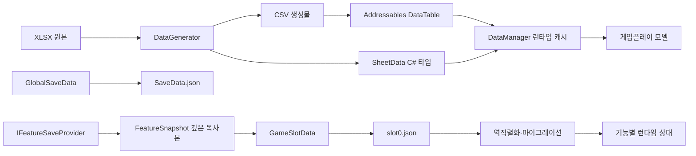
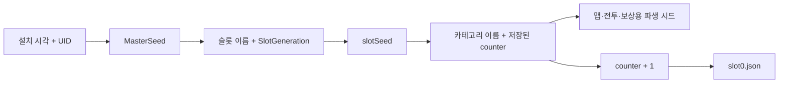
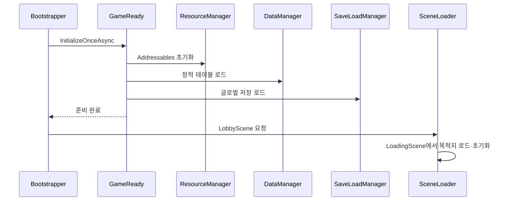

# AngelBeat 데이터·저장·시드 흐름

이 문서는 현재 프로젝트에서 정적 데이터, 런타임 데이터, 영속 저장 데이터와 시드가 어디에서 생성되고 누구에게 소유되는지 정리한다.

## 1. 전체 구조

정적 데이터와 저장 데이터는 서로 다른 계층이다. `DataManager`의 정적 테이블은 저장 파일에 복제하지 않는다. 저장 파일에는 테이블 ID와 플레이 진행처럼 실행 중 바뀌는 값만 보관해야 한다.

## 2. 정적 데이터

### 원본과 생성물

| 계층 | 위치 | 책임 |
| --- | --- | --- |
| 원본 | `DataGenerator/XLSXS/*.xlsx` | 사람이 편집하는 데이터 원본 |
| 생성물 | `Assets/GamePlay/Common/CommonResources/CSV/MEMCSV/*.csv` | 런타임에서 읽는 값 |
| 생성 코드 | `Assets/Core/Scripts/Data/*Data.cs` | CSV 스키마와 파서 |
| 등록 | `Assets/AddressableAssetsData/AssetGroups/DataTable.asset` | `CSV/MEMCSV/{TypeName}` 주소 연결 |
| 런타임 | `DataManager` | 타입별 `Dictionary<long, SheetData>` 캐시 및 조인 맵 |

현재 XLSX, CSV, C# 데이터 타입, Addressables 항목은 각각 12개로 일치한다.

### 로드 순서

1. `GameReady.InitializeOnceAsync()`가 Addressables를 초기화한다.
2. `DataManager.InitAsync()`가 모든 `SheetData` 파생 타입을 검색한다.
3. 타입 이름으로 `CSV/MEMCSV/{TypeName}`을 병렬 로드한다.
4. 생성된 `ParseAsync()`가 CSV 전체 행을 타입별 딕셔너리로 변환한다.
5. 빈 테이블이나 누락된 Addressable은 초기화 실패로 처리한다.
6. 모든 테이블이 성공한 뒤에만 `DataManager.Ready`가 `true`가 된다.

### 데이터 추가 절차

새 테이블을 추가할 때는 다음 네 항목을 항상 한 묶음으로 변경한다.

1. XLSX 원본 추가 또는 수정
2. DataGenerator로 CSV와 C# 파서 생성
3. CSV를 Addressables `DataTable` 그룹에 `CSV/MEMCSV/{TypeName}`으로 등록
4. `StaticDataConsistencyTest` 3개 실행

## 3. 저장 데이터와 런타임 상태

### 저장 단위

| 데이터 | 수명 | 저장 위치 | 비고 |
| --- | --- | --- | --- |
| `GlobalSaveData` | 설치 단위 | `userdata/SaveData.json` | UID, 설정, 슬롯 메타데이터, `MasterSeed`, `SlotGeneration` |
| `GameSlotData` | 새 게임 단위 | `userdata/slot0.json` | 슬롯 진행, RNG 카운터, 기능별 스냅샷 |
| `FeatureSnapshot` | 기능 단위 | `GameSlotData.Features` | `Explore`, `Battle`, `Village` 키로 교체 저장 |
| `DataManager` 캐시 | 실행 단위 | 저장하지 않음 | XLSX에서 파생된 정적 데이터 |
| `ExploreSession`/`BattleSession` | 씬 전환 단위 | 저장하지 않음 | 현재 실행에서만 쓰는 전달 객체 |

### 스냅샷 경계

`GameSlotData.WriteSnapshot()`은 전달받은 스냅샷의 깊은 복사본을 저장한다. `TryGet()`도 저장 캐시의 깊은 복사본을 반환한다.

따라서 다음 세 객체는 서로 독립적이다.

- 기능 매니저가 수정하는 런타임 스냅샷
- `GameSlotData`가 가진 마지막 캡처 상태
- 로드 또는 조회 호출자에게 반환된 복원용 스냅샷

기능 매니저는 `IFeatureSaveProvider`를 구현하고 활성화될 때 `SaveLoadManager`에 등록한다. 일반 저장, 일시 정지 저장, 종료 저장은 provider의 `Capture()` 결과를 슬롯에 기록한다.

### 파일 기록

`SlotIO`는 임시 파일에 먼저 기록한 후 `File.Replace` 또는 `File.Move`로 슬롯 파일을 교체한다. 같은 슬롯 경로에 대한 작업은 잠금과 keyed 작업 큐로 직렬화된다.

글로벌 저장은 현재 `Util.SaveJsonNewtonsoft()`의 직접 기록 방식을 사용한다. 슬롯 파일과 같은 임시 파일 교체 방식은 아직 적용되지 않았다.

## 4. 시드 흐름

- `MasterSeed`는 설치 단위로 유지된다.
- `SlotGeneration`은 새 게임을 만들 때 증가한다.
- 같은 슬롯 이름을 다시 사용해도 세대가 다르므로 다른 `slotSeed`를 얻는다.
- 같은 `slotSeed`, 카테고리 이름, 카운터 조합은 같은 결과를 재현한다.
- 카운터는 `GameSlotData.RngCounters`에 저장되므로 로드 뒤 다음 난수부터 이어진다.
- 탐사 맵은 `Explore_{Dungeon}_{Floor}` 카테고리에서 `mapSeed`를 파생하고 스냅샷에 `mapSeed`, 생성기 버전, 설정 서명을 함께 기록한다.
- 복원은 저장된 생성기 버전의 알고리즘을 사용한다. 현재 버전에서 설정 서명이 달라졌다면 다른 맵을 조용히 만들지 않고 실패한다.
- 생성 규칙, 제약과 다중 시드 검증 절차는 `Docs/ProceduralExploreMap.md`에 정리한다.

## 5. 부트와 씬 초기화

- `GameReady`는 동시 호출을 직렬화하며 성공 후에는 다시 초기화하지 않는다.
- `SaveLoadManager`와 `SoundManager`도 `Init()` 재호출을 무시한다.
- `SceneLoader`는 진행 중인 전환에 들어온 두 번째 요청을 차단한다.
- 목적지 초기화 콜백이 실패하면 목적지 씬을 언로드하고 로딩 씬에 남는다.

## 6. 현재 지원 범위와 남은 작업

### 활성 경로

- `ExploreManager`만 현재 `IFeatureSaveProvider`를 구현한다.
- `ExploreSnapshot`은 던전, 층, 맵 시드, 플레이어 위치, 방문 셀과 완료 이벤트를 저장한다.
- `BattleSnapshot`과 `VillageSnapshot` 타입은 존재하지만 provider 구현은 없다.

### 계속하기 제한

탐사 스냅샷에는 파티를 재구성할 데이터가 없고, 전투 스냅샷에는 스테이지와 전체 전투 상태가 부족하다. 이 상태에서 초기화 콜백만 실행하면 null 파티 또는 디버그 전투로 잘못 시작할 수 있다.

따라서 현재 `ContinueGame`은 마지막 상태가 `Explore` 또는 `Battle`이면 로비에 머물며 미지원 오류를 출력한다. 계속하기를 활성화하려면 우선 다음 모델이 필요하다.

1. 정적 캐릭터 ID와 런타임 성장치를 분리한 `PartySnapshot`
2. `ExploreSnapshot`에서 파티 또는 슬롯 공용 파티 스냅샷 참조
3. 전투 중 재개를 지원한다면 스테이지, 턴, 유닛 상태와 복귀 씬을 포함한 전투 스냅샷
4. Battle/Village용 `IFeatureSaveProvider`와 복원 진입점

### 비활성 레거시 모델

다음 타입은 현재 참조가 없으며 실제 저장 경로에 참여하지 않는다.

- `ExploreSaveData`
- `BattleSaveData`
- `VillageSaveData`
- `CharacterProgressSaveData`
- `ISaveSink`

새 저장 기능은 이 타입들을 연결하기보다 `FeatureSnapshot`과 `IFeatureSaveProvider` 경로에 추가한다. 레거시 타입 삭제는 별도 정리 작업에서 처리한다.

## 7. 회귀 테스트

| 테스트 | 기대 결과 | 검증 범위 |
| --- | --- | --- |
| `StaticDataConsistencyTest` | 3개 통과 | XLSX/CSV/C#/Addressables 일치, 스키마, 전체 행 파싱 |
| `SaveTest` | 통과 | 기본값, 깊은 복사, JSON 왕복, 맵 재현 계약, RNG 연속성, 레거시 정규화 |
| `ExploreMapGenerationVerifier` | 설정당 100 시드 통과 | 결정성, 다양성, 연결성, 앵커, End 봉쇄, 심볼 수량, 설정 불일치 거부 |
| BootScene Play | LobbyScene 도착 | Addressables → 데이터 → 글로벌 저장 → 매니저 준비 순서 |

Boot 로그의 정상 완료 기준은 `All Managers Initialized to Run`이 한 번 출력되고 목적지 씬 초기화 오류가 없는 것이다. `slotSeed=0`인 레거시 슬롯은 RNG를 만들지 않고 나머지 데이터를 복원하며 경고를 남긴다.
