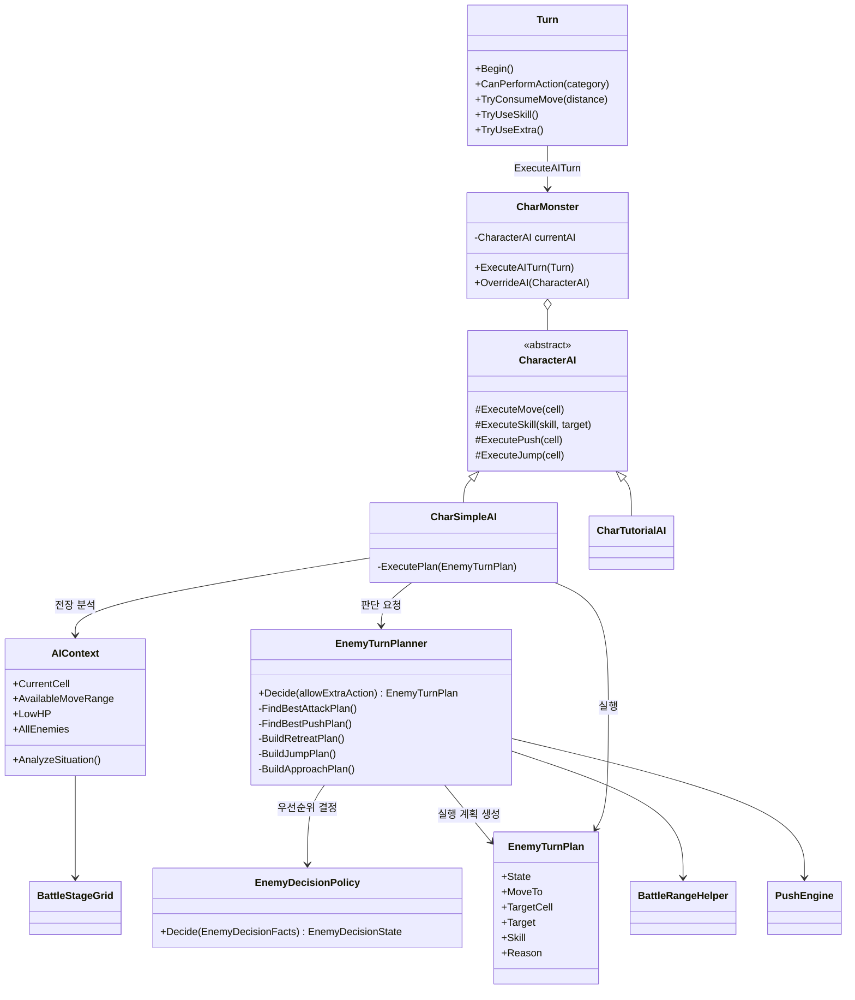

# 적 AI 구조

## 선택: 턴 단위 우선순위 상태 머신

현재 전투는 실시간 추적이 아니라 `Turn`이 몬스터에게 한 번의 행동 기회를 주는 구조다. 맵도 자유 이동 공간이 아니라 `BattleStageGrid`의 셀, 수평 이동, 제한된 점프, 스킬 범위로 구성된다. 따라서 장시간 `Running` 상태를 유지하는 Behavior Tree보다 매 턴 전장을 다시 읽는 얕은 상태 머신이 적합하다.

프로젝트의 `Modules/BT`는 그래프 편집기와 최소 노드 런타임만 있고 전투의 비동기 행동, 그리드, 턴 행동력과 연결되어 있지 않다. 이를 완성해 사용하는 비용에 비해 현재 필요한 적 행동 종류는 적다.

## 클래스 구조

`EnemyDecisionPolicy`는 Unity 객체를 모르는 순수 순차 판단기다. `EnemyTurnPlanner`는 실제 맵에서 공격·밀치기·이동 후보를 계산하고, 정책이 선택한 상태에 해당하는 `EnemyTurnPlan`을 반환한다. `CharSimpleAI`는 계획을 실행할 뿐 우선순위를 다시 판단하지 않는다.

## 기존 구조에서 확인한 문제

- 모든 이동 가능 칸 × 모든 스킬 × 양방향 × 모든 타깃의 행동 세트를 생성해 작은 전투에도 후보 수가 빠르게 증가했다.
- `AIContext.AvailableMoveRange`가 대입되지 않아 이동이 필요한 후보가 필터에서 제거됐다.
- 적 목록을 가져올 때 진영을 두 번 반전해 같은 편을 적으로 분석했다.
- 안전도 계산이 비활성화되어 항상 같은 값이 반환됐다.
- 가상 위치의 스킬 범위를 확인하려고 실제 캐릭터 Transform과 방향을 잠시 변경했다.
- 점프와 공격을 하나의 배타적 행동으로 다뤄, 턴 규칙상 함께 쓸 수 있는데도 점프 후 남은 스킬 행동을 사용하지 못했다.

## 현재 의사결정 순서

1. 낙사 또는 밀치기 피해로 처치할 수 있으면 밀친다.
2. 현재 위치나 이번 턴에 걸어갈 수 있는 위치에서 공격할 수 있으면 공격한다.
3. 체력이 30% 이하이고 공격할 수 없으면 가장 가까운 적과 거리를 벌린다.
4. 공격할 수 없지만 유효한 일반 밀치기가 있으면 밀친다.
5. 다른 층이나 끊긴 발판 때문에 필요하면 점프한다.
6. 같은 층에서 가장 가까운 적과 거리를 줄이는 칸으로 이동한다.
7. 실행 가능한 행동이 없으면 대기한다.

공격 후보끼리는 낮은 체력의 타깃, 스킬 피해 계수, 이동 비용을 비교한다. 저체력 상태에서는 공격 가능한 위치 중 적과 거리가 먼 위치를 더 선호한다. 점프 후에는 부가 행동을 제외하고 한 번 더 판단하여 이동 또는 스킬을 사용할 수 있다.

## 테스트 구조

### Edit Mode: 순차 판단 규칙

`EnemyDecisionPolicyTests`는 Unity 씬을 띄우지 않고 다음 우선순위를 검사한다.

- 적이 없으면 항상 대기
- 확정 처치 밀치기가 공격보다 우선
- 공격이 저체력 후퇴보다 우선
- 공격 불가 저체력 상태에서는 일반 밀치기보다 후퇴가 우선
- 걸어서 후퇴할 수 없으면 후퇴 점프
- 일반 밀치기가 위치 변경보다 우선
- 필요한 층 이동이 걷기보다 우선
- 일반 접근이 불필요한 점프보다 우선
- 걷기 불가 시 점프, 모든 행동 불가 시 대기

점수의 정확한 숫자는 테스트하지 않는다. 점수는 밸런싱 값이므로 바뀔 수 있고, 테스트는 선택된 상태와 우선순위 계약만 고정한다.

### Play Mode: 실제 전투 연결

`BattleFlowPlayModeTest.DebugBattle_EnemyAiTurnCompletesAndReturnsControl`은 프로덕션 로딩 경로로 디버그 전투를 연 뒤 적 턴을 시작한다. AI가 제한 시간 안에 행동을 마치고 플레이어 턴으로 제어권을 반환하는지 확인한다. 실행 중 발생하는 Unity 오류 로그도 테스트 실패로 처리된다.

권장 실행 순서는 빠른 `EnemyDecisionPolicyTests`를 매 변경마다 실행하고, 전투 액션이나 맵 규칙을 수정했을 때 Play Mode 스모크 테스트까지 실행하는 것이다.

## 확장 기준

일반 몬스터는 이 상태 머신을 공유하고, 차이는 데이터로 두는 편이 좋다. 추후 몬스터별 성향이 필요하면 `EnemyTurnPlanner`에 공격성, 후퇴 체력 비율, 밀치기 선호도 같은 소수 파라미터를 주입한다. 보스처럼 여러 턴에 걸친 패턴과 페이즈가 필요한 경우에만 별도 `CharacterAI` 구현을 추가한다. 현재의 `OverrideAI` 계약은 튜토리얼 및 특수 AI에 그대로 사용할 수 있다.
